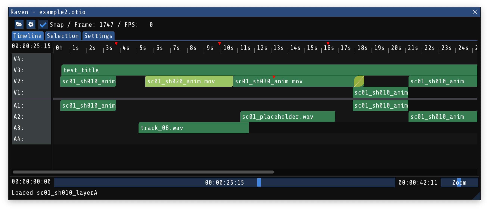

# Raven - OTIO Viewer

An experimental re-write of OpenTimelineIO's `otioview` timeline viewer application.

## Building (macOS, Windows, Linux)

	% mkdir build
	% cd build
	% cmake ..
	% cmake --build .
	% ./raven ../example.otio

## Building (WASM via Emscripten)

	% mkdir build-web
	% cd build-web
	% emcmake cmake ..
	% cmake --build .
	% emrun ./raven.html
	
See also: `serve.py` as an alternative to `emrun`, and as
a reference for which HTTP headers are needed to host the WASM build.

## Toubleshooting

If you have trouble building, these hints might help...

You might need to init/update submodules:
  % git submodule init
  % git submodule update

See `.github/workflows/build.yaml` for more details.

## Example files

The `examples` folder contains some example `.otio` files for testing.

The El Fuente and Meridian [examples provided by Netflix](https://opencontent.netflix.com/) (under the
Creative Commons Attribution 4.0 International Public License) were [converted to OTIO, along with several
other examples here](https://github.com/darbyjohnston/otio-oc-examples).

## Thanks

Raven was made possible by these excellent libraries:
- [OpenTimelineIO](https://opentimeline.io)
- [Dear ImGui](https://github.com/ocornut/imgui)
- [ImPlot](https://github.com/epezent/implot)
- [glfw](https://github.com/glfw/glfw)
- [nativefiledialog](https://github.com/mlabbe/nativefiledialog)

## Help Wanted

- Fully standalone executable:
- Cross-platform build + GitHub Actions
  - Mac
    - App bundle. [Try this](https://stackoverflow.com/questions/53560288/how-to-create-a-macos-app-bundle-with-cmake).
  - Linux
    - CI is building, does it actually run?
  - Windows
    - Needs CI setup
    - Needs file open/save dialog
      - Maybe [this could work](https://stackoverflow.com/questions/69935188/open-a-file-in-emscripten-using-browser-file-selector-dialogue)?
  - Emscripten
    - Where can we host this (needs specific HTTP headers. See `serve.py`)
- Mac build has Retina high DPI scaling issues
  - When dragging the window from one display to another, it doesn't adapt to different DPI correctly
  - When resizing the window, sometimes the window drifts or offsets strangely - worse when an external monitor is plugged into my laptop.
  - Does the same thing happen on Linux or Windows?
  - Maybe switch to native macOS Dear ImGui backend?
  - WIP: Trying glfw + Metal backend
- JSON Inspector:
  - Syntax highlighting
    - Maybe this one? https://github.com/BalazsJako/ImGuiColorTextEdit
  - This comment in imgui.h sounds helpful
    - // - If you want to use InputText() with std::string or any custom dynamic string type, see misc/cpp/imgui_stdlib.h and comments in imgui_demo.cpp.
  - Edit JSON to replace selected object?
    - This would let you explore & understand how changes affect the composition
- Multiple selection, copy, paste, undo, redo?
- Various operations from `otiotool`?

## To Do

- Double-click to expand/collapse nested compositions
- Double-click a Clip to expand/collapse it's media reference
- Show time-warped playhead inside media reference or nested composition
- Performance optimization
  - avoid rendering tracks outside the scroll region
  - avoid rendering items smaller than a tiny sliver
  - Experiment with drawing the timeline without using a Dear ImGui table
- Arrow keys to navigate by selection
  - This sort of works already via ImGui's navigation system, but it is too easy to get stuck on a marker, or to walk out of the timeline.
  - Can this be rectified by turning off keyboard navigation on the widgets outside the timeline?
- Multiple timelines in separate tabs or windows?
  - Look at ImGui document-based demo code for reference.
  - Might be fine to just open multiple instances of the app.
- Inspector:
  - Show summarized timing information (ala otiotool --inspect)
  - Range slider could be useful:
    - https://github.com/ocornut/imgui/issues/76#issuecomment-288304286
  - Per-schema inspector GUI
    - Items:
      - enable/disable
    - Clips:
      - show media_reference
      - adjust available_range of media reference
    - Transitions:
      - nicer GUI for adjusting in/out offsets
      - avoid extending beyond range of adjacent Items
      - avoid overlap with adjacent Transitions
    - Markers:
      - color picker
    - Compositions:
      - show source_range limits in the timeline 
    - LinearTimeWarp:
      - time_scale graph could be nicer
    - UnknownSchema:
      - Can we show properties via SerializableObject's introspection?

